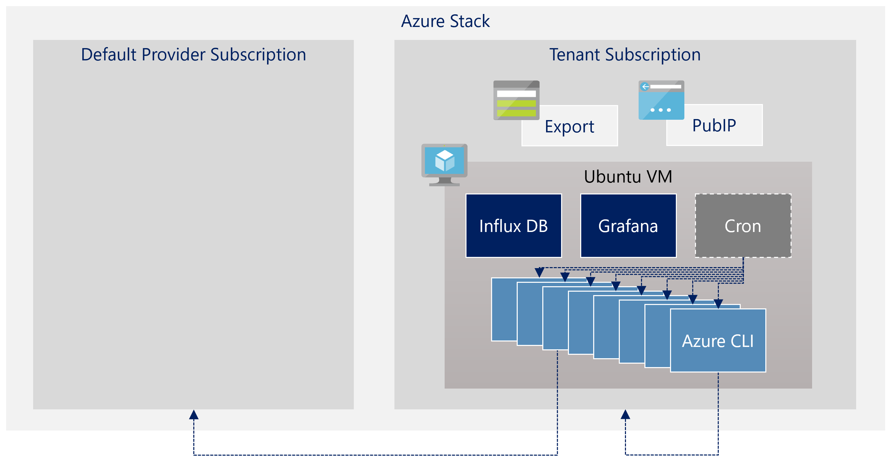

# AzureStack Uptime

Azure Stack Uptime is an open source based solution that tests the availability of Azure Stack endpoints and workloads. The solution will start testing Azure Stack endpoints directly after it is deployed. 

The solution runs on a single VM deployed to an Azure Stack tenant subscription. Multiple scripts are executed at various intervals with cron to test endpoints and workload availability. Each script is executed in a docker container with Azure CLI installed. The scripts write their output to an Influx time series database. The data in the database in visualized with Grafana. Influx and Grafana are both running in a docker container as well.
The data from the Influx database is exported to CSV containing the data from the previous week. The CSV is exported daily and stored in the export storage account.



The solution only runs open source software and does not require any licenses. No data is sent out of the solution. Once it is deployed, the solution does not require any outbound connectivity.

The default Ubuntu 18.04-LTS or 16.04-LTS image available in Azure Stack can be used. It is also possible to pre-provision an Ubuntu image and import it into an diconnected Azure Stack environment. 

## Prerequistses

The solution has the following prerequisites.

- Ubuntu image (18.04-LTS or 16.04-LTS). You can use the images available in the Azure marketplace feed in Azure Stack marketplace management, or if you have a disconnected environment, provision an Ubuntu image yourself [see link for the steps]
- An SPN created in the Identity Provider (AAD or ADFS). The authentication method for the SPN account must be with a key (certificate based authentication is not supported). The SPN must have ```reader``` permissions on the default provider subscription and ```contributor``` permissions on a tenant subscription [see link for the steps].
- The linux vm extension v2.0 needs to be available in the Azure Stack enviroment. It can be either installed through Marketplace Management or imported with the [offline tool] for disconnected environments.
- A tenant user in the same tenant as the SPN account that has at least ```contributor``` permissions to a resource group that the solution will be deployed to.
- An SSH key pair for authenticating to the solution VM. [see link for the steps]

## Deploy online using an ARM template

This procedure requires outbound connectivity for the VM. On avarage the deployment will take ~14 minutes.

To deploy the solution, you can either 

- select the Template Deployment item from the Azure Stack marketplace, copy the content of the mainTemplate.json of this repository into the template builder, and submit the parameter values
- or deploy the mainTemplate.json through Azure CLI or PowerShell and submit the parameter values.

The deployment template requires the following inputs
- adminUserName: the username is used for authenticating to the Linux VM.
- sshPublicKey: the SSH public key is inserted into the Linux VM. Once you authenticate with your private key stored on you local machine signin will be granted. Without the private key on your machine you cannot connect to the VM. With the proper permissions Azure Stack allows you to reset SSH public in the VM (in case you lose you're private key)
- appId: this is the application Id of the SPN created in the identity store.
- appKey: this is the key (password) for the SPN created in the identity store.
- grafanaPassword: this password is used to authenticate to the Grafana portal, once the deployment is completed.

The deployment template also provides the following optional inputs:
- ubuntuSku: if a value for this parameter is not specified, the default value of 18.04-LTS will be used. Alternatively you can specify 16.04-LTS as input value. No other input values are allowed
- triggerdId: This value is only relevant for updating the solution. The solution is updating by deploying the same to the same resource group with existing resources from an earlier deployment. If the environment is deployed for the first time, the Linux VM extension is triggered automatically. On subsequent deployments to the same resource group with the existing resources, the Linux VM extension is not executed by default. By specifying a different value for the triggerId the Linux VM extension executes again (as long as the triggerId has a different value than the previous deployment). The default value of the triggerId is 1. It excepts any value between 1 and 100.

## Deployment for disconnected environment

The procedure is only intended for disconnected environments that do not have any outbound connectivity for workloads running on Azure Stack. This procedure will take ~1 hour.

- Download Ubuntu image to connected workstation 
- Install Azure VM Agent [link to steps]
- Install prerequisistes (repos, docker, pull images)
- Import the VHD to a storage account is the tenant subscript
- Deploy ARM template with using custom VHD as input for managed disk

## Access

Once the deployment is complete the solution provides the following endpoints

- **Grafana portal** on **https://[loadbalancer-public-ip-address]:3000**
- **SSH to the VM** with **ssh [adminUserName]@[loadbalancer-public-ip-address]**

Each endpoint requires authentication. The Grafana portal can be accessed with username **admin** and the password specified for the **grafanaPassword** parameter. Connecting with SSH to the VM requires the the client to have the private key of the SSH key pair (matching the public key specified for the sshPublicKey parameter during deployment) imported into the terminal client.